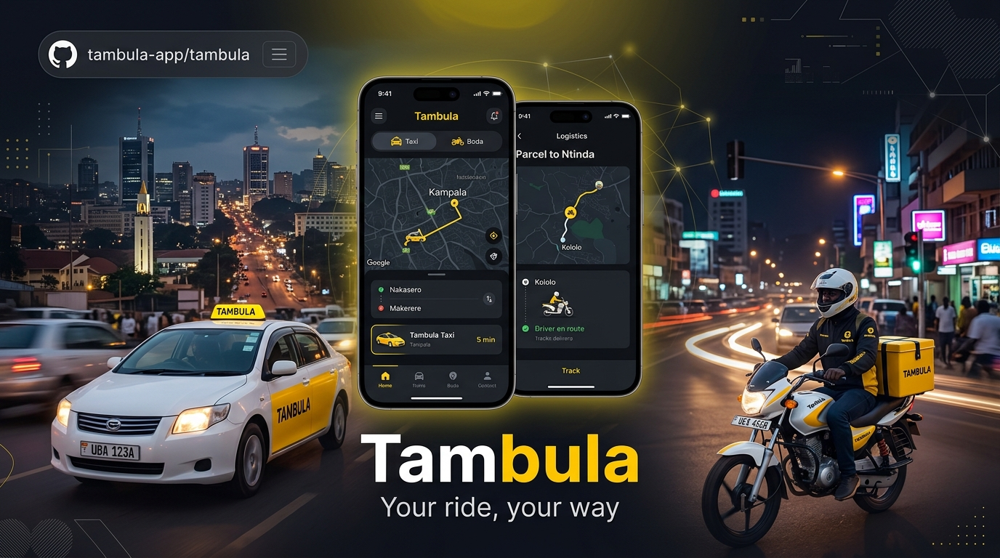
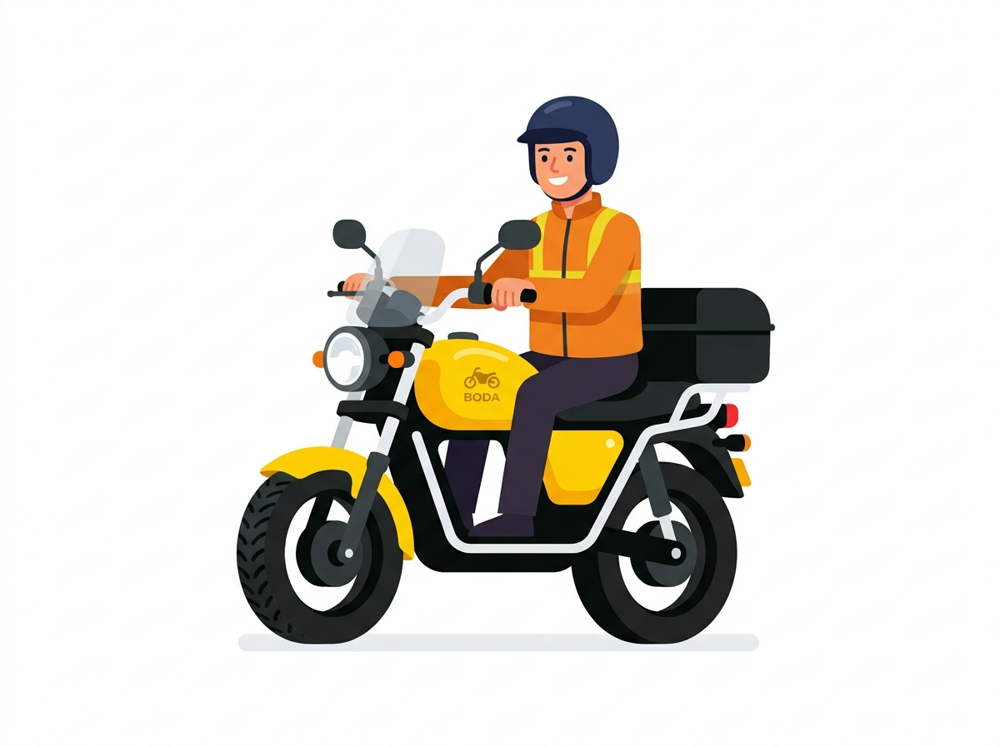
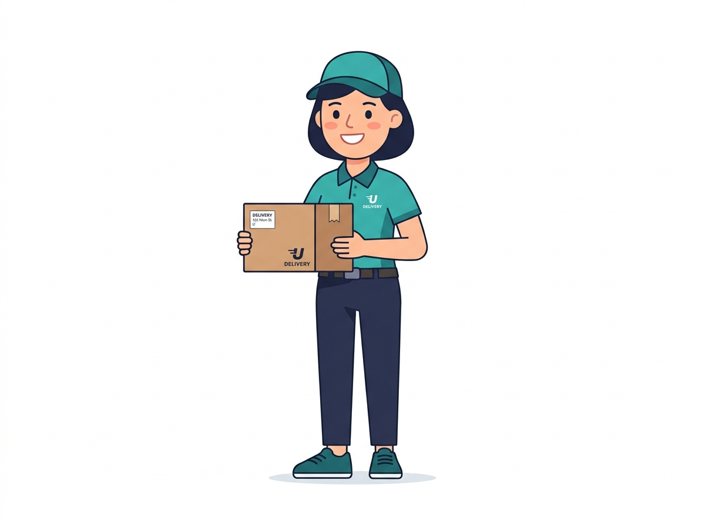
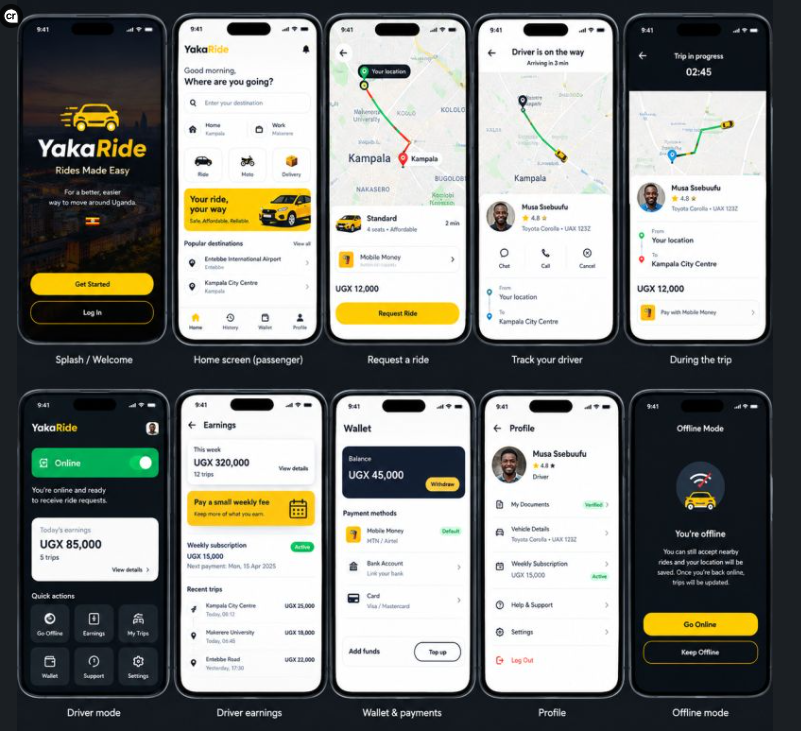

<div align="center">

# Tambula — Your Ride, Your Way

<p align="center">
  
</p>

[](https://reactnative.dev/)
[](https://expo.dev/)
[](https://github.com/faisalkimz/Traveling)
[](https://github.com/faisalkimz/Traveling)
[](LICENSE)

**Tambula** is a premier, Uber-tier ride-hailing and on-demand logistics platform custom-engineered for Kampala, Entebbe, and Wakiso. Designed to effortlessly navigate East Africa's bustling urban mobility needs with upfront pricing in UGX, seamless MTN Mobile Money & Airtel Money integration, and high-speed Boda dispatch.

</div>

---

## 📱 App Experience & Screenshots

### Minimalist Onboarding Experience
Clean, human, and modern cartoon onboarding inspired by the best mobility apps:

| 🚖 1. Request a Ride | 🏍️ 2. Beat the Traffic | 📦 3. Express Delivery |
|:---:|:---:|:---:|
|  |  |  |
| *Affordable cabs & spacious XL with vetted 5-star drivers.* | *Zip through Jinja Road gridlock safely with certified riders.* | *Door-to-door parcel delivery with 4-digit recipient PIN.* |

<br />

<div align="center">
  <h3>✨ Golden Reference Architecture</h3>
  
</div>

---

## ⚡ Key Capabilities

### 🚗 Passenger Experience
- **Cinematic Clean Splash**: Ambient Kampala backdrop with instant auto-transition and tap-to-skip.
- **Service Categories**:
  - **Tambula Comfort**: Air-conditioned, modern sedans for city commutes.
  - **Tambula XL**: 6-passenger SUVs for airport runs to Entebbe International Airport (EBB).
  - **Tambula Boda**: Safe, speed-governed motorbikes with complimentary hairnets and DOT-rated helmets.
  - **Tambula Delivery**: Same-day courier dispatch with real-time route tracing.
- **Interactive Trip Lifecycle**: Live radar driver search, driver found card, real-time arrival counter, active trip telemetry, and post-trip ratings.
- **Safety Toolkit**: Instant 999 Police SOS trigger, live trip location sharing via WhatsApp/SMS, and trusted contacts management.
- **Activity & Rebooking**: Uber-style trips feed with status filters, route snapshot maps, PDF tax receipt downloads, and 1-tap "Ride Again" rebooking.

### 🛵 Driver Ecosystem
- **Instant Request Radar**: Audible incoming job notifications with 15-second response timers, estimated earnings, and pickup distances.
- **Navigation Overlay**: Turn-by-turn routing to passenger pickup and destination drop-off.
- **Weekly Earnings & Ledger**: Daily income bar charts, gross trip tallies, weekly subscription tracking, and instant cashout to MTN MoMo / Airtel Money accounts.
- **Driver Verification**: Document checklist (Driving Permit, PSV License, National ID, Third Party Insurance).

### 💳 Local Uganda Payment Infrastructure
- **Zero Cash Hassle**: Direct push integration with **MTN Mobile Money** (`*165#`) and **Airtel Money** (`*185#`).
- **Tambula Wallet**: Digital ledger with privacy balance eye toggle, quick top-up presets (`+10,000`, `+25,000`, `+50,000`, `+100,000 UGX`), and automated fare settlements.
- **Cash Backup**: Transparent cash fare collection with automated change reminders.

---

## 📂 Repository Structure

The repository maintains a clean dual-project setup sharing identical component logic:

```text
Traveling/
├── docs/
│   ├── assets/              # GitHub hero banners & graphics
│   └── screenshots/         # App flow & onboarding screenshots
├── TamblaExpo/              # 🚀 Primary Expo SDK 57 project (recommended for rapid dev)
│   ├── assets/              # App icons, splash screens, onboarding illustrations
│   ├── src/
│   │   ├── components/      # Common UI (TamblaButton, WalletCard, RideCard, etc.)
│   │   ├── navigation/      # Stack & Tab Navigators (Auth, Passenger, Driver)
│   │   ├── screens/
│   │   │   ├── auth/        # Splash, Onboarding, PhoneLogin, OTP, Register
│   │   │   ├── passenger/   # Home, Destination Search, Fare Breakdown
│   │   │   ├── ride/        # Searching, Driver Found, Driver Arrived, Active Trip
│   │   │   ├── delivery/    # Express Courier Dispatch, Parcel Tracking
│   │   │   ├── driver/      # Driver Home, Earnings, Incoming Request, Profile
│   │   │   ├── wallet/      # MoMo Top-Up, Transaction History, Digital Receipts
│   │   │   └── profile/     # Saved Places, Safety Toolkit, Customer Support
│   │   └── theme/           # Design tokens (colors, typography, spacing, radius)
│   ├── App.js               # Safe area & gesture root container
│   └── package.json
├── Tambla/                  # ⚙️ Bare React Native project (Native Android & iOS engines)
├── tambla_antigravity_package/ # Product specs, design references & master build docs
├── .gitignore               # Clean root git ignore (excludes node_modules & build artifacts)
└── README.md                # Project documentation
```

---

## 🚀 Quick Start

### Option A: Expo Go (Recommended for Mobile Device Testing)

1. **Clone the repository**:
   ```bash
   git clone https://github.com/faisalkimz/Traveling.git
   cd Traveling/TamblaExpo
   ```

2. **Install dependencies**:
   ```bash
   npm install
   ```

3. **Start the development server**:
   ```bash
   npx expo start
   ```

4. **Run on your device**:
   - Open **Expo Go** on your iPhone or Android phone.
   - Scan the QR code displayed in the terminal to load the app immediately.

---

### Option B: Bare React Native CLI

1. **Navigate to the bare React Native workspace**:
   ```bash
   cd Traveling/Tambla
   npm install
   ```

2. **Android**:
   ```bash
   npx react-native run-android
   ```

3. **iOS** (macOS required):
   ```bash
   cd ios && pod install && cd ..
   npx react-native run-ios
   ```

---

## 🛠️ Technology Stack

- **Core**: [React Native 0.87.1](https://reactnative.dev/), [React 19.2.3](https://react.dev/)
- **Expo Framework**: [Expo SDK 57](https://expo.dev/)
- **Navigation**: [React Navigation 7](https://reactnavigation.org/) (Native Stack + Bottom Tabs)
- **State & Storage**: [@react-native-async-storage/async-storage](https://github.com/react-native-async-storage/async-storage)
- **Gestures**: [React Native Gesture Handler](https://docs.swmansion.com/react-native-gesture-handler/) & [Safe Area Context](https://github.com/th3rdwave/react-native-safe-area-context)
- **Icons**: Vector Icons ([Ionicons](https://ionic.io/ionicons/))
- **Design System**: Tailored HSL dark palette, signature Tambula Gold (`#FFCC00`), and minimalist typography.

---

## 🤝 Contributing

Contributions are warmly welcome!
1. Fork the Project
2. Create your Feature Branch (`git checkout -b feature/AmazingFeature`)
3. Commit your Changes (`git commit -m 'Add some AmazingFeature'`)
4. Push to the Branch (`git push origin feature/AmazingFeature`)
5. Open a Pull Request

---

## 📄 License

Distributed under the MIT License. See `LICENSE` for more information.

<div align="center">
  <sub>Built with ❤️ for Kampala and the Future of African Urban Mobility.</sub>
</div>
